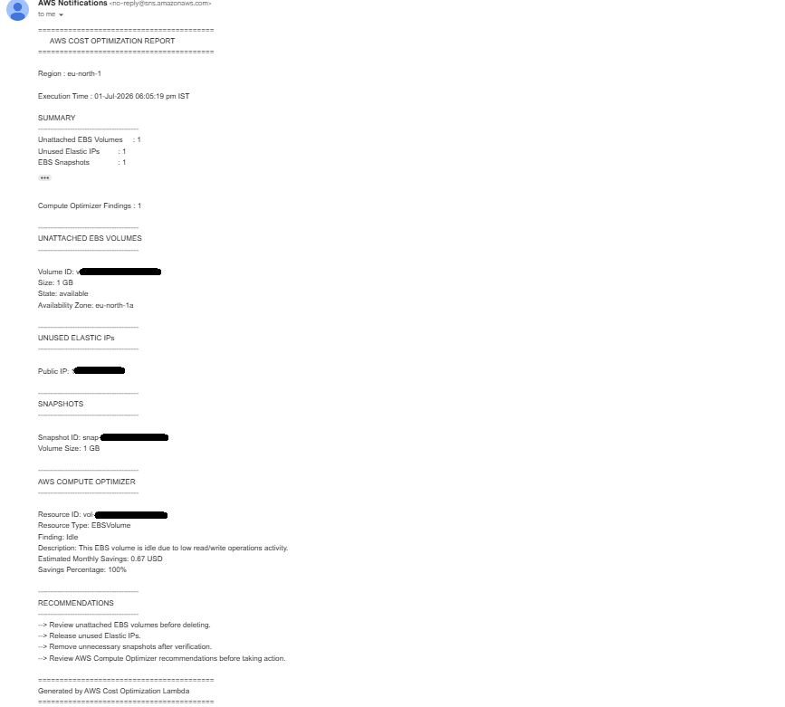

# AWS Cost Optimization using AWS Lambda

## Project Overview

This project automatically identifies AWS resources that may be generating unnecessary costs and sends a detailed cost optimization report via Amazon SNS.

The solution is built using AWS Lambda and integrates with multiple AWS services to help identify:

- Unattached EBS Volumes
- Unused Elastic IP Addresses
- User Snapshots
- AWS Compute Optimizer Idle Resource Recommendations

The generated report is delivered through email using Amazon SNS.

## Features

- Detects unattached EBS volumes
- Detects unused Elastic IP addresses
- Lists user-owned EBS snapshots
- Fetches AWS Compute Optimizer idle resource recommendations
- Calculates potential monthly savings
- Generates a structured cost optimization report
- Sends email notifications using Amazon SNS
- Displays AWS Region and execution time in the report
- Includes clear recommendations for each detected resource

## Architecture

The project follows a simple serverless architecture

```text
EC2 Resources
      │
      ▼
AWS Lambda
      │
      ├── EC2 API
      ├── Compute Optimizer API
      ├── EBS Snapshots
      └── Elastic IPs
      │
      ▼
Amazon SNS
      │
      ▼
Email Notification
```

## AWS Services Used

| Service | Purpose |
|----------|----------|
| AWS Lambda | Runs the automation script |
| Amazon EC2 | Fetches EBS volumes, snapshots and Elastic IPs |
| AWS Compute Optimizer | Detects idle resources and estimated savings |
| Amazon SNS | Sends the cost optimization report through email |
| IAM | Provides secure permissions for Lambda |


## Project Workflow

1. AWS Lambda is triggered manually or on a schedule using Amazon EventBridge.
2. Lambda scans the AWS account for:
   - Unattached EBS Volumes
   - Unused Elastic IP Addresses
   - User-owned Snapshots
3. Lambda fetches idle resource recommendations from AWS Compute Optimizer.
4. Resource details and estimated savings are collected.
5. A structured cost optimization report is generated.
6. Amazon SNS sends the report to the configured email address.
7. The user reviews the report and removes unused resources to reduce AWS costs.

## Project Structure

```text
aws-cost-optimization-lambda-project/
│
├── architecture/
│   └── README.md
│
├── docs/
│   └── README.md
│
├── lambda/
│   └── lambda_function.py
│
├── screenshots/
│   └── README.md
│
├── .gitignore
├── LICENSE
└── README.md
```

### Folder Description

| Folder/File | Purpose |
|-------------|----------|
| lambda | Contains the AWS Lambda source code |
| docs | Project documentation and setup guides |
| architecture | Architecture diagrams and design documents |
| screenshots | Screenshots of the project execution |
| README.md | Main project documentation |
| LICENSE | Project license |
| .gitignore | Files ignored by Git |

## Prerequisites

Before using this project, ensure you have:

- AWS Account
- AWS Lambda
- Amazon EC2
- Amazon SNS
- AWS Compute Optimizer enabled
- IAM Role with required permissions
- Python 3.x
- Boto3 (AWS SDK for Python)

## Required IAM Permissions

The Lambda execution role should have permissions for:

- AmazonEC2ReadOnlyAccess
- ComputeOptimizerReadOnlyAccess
- AmazonSNSFullAccess (or publish permission)

## Installation & Setup

### 1. Clone the repository

```bash
git clone https://github.com/<your-github-username>/aws-cost-optimization-lambda.git
```

### 2. Create an SNS Topic

- Create an Amazon SNS Topic.
- Create an Email Subscription.
- Confirm the subscription from your email.

### 3. Create an IAM Role

Attach the required IAM permissions to the Lambda execution role.

### 4. Create an AWS Lambda Function

- Runtime: Python 3.x
- Upload the project source code.
- Attach the IAM role.

### 5. Update the SNS Topic ARN

Replace the Topic ARN in `lambda_function.py` with your own SNS Topic ARN.

### 6. Test the Lambda Function

Run a test event from the Lambda console.

The function will:

- Scan AWS resources
- Fetch Compute Optimizer recommendations
- Generate the report
- Send the email through SNS

  ## Sample Email Output

The Lambda function sends a detailed AWS Cost Optimization report to the subscribed email through Amazon SNS.




